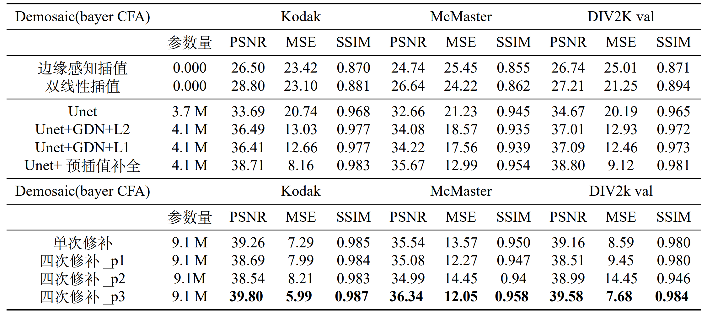

# 端到端递进修正的去马赛克算法 
## End-to-end recursively corrected demosaicing algorithm

C_N_U IE 的校内实习的项目代码，着重图像去马赛克算法，通过实习了解相机成像获得马赛克原因和去马赛克算法流程。

C_N_U IE's on-campus internship project code focusing on image de-mosaicing algorithms, through which we learnt about the causes of mosaic obtained from camera imaging and the demosaicing algorithm process.

<!-- PROJECT LOGO -->
<br />

<p align="center">
  <a href="https://github.com/shaojintian/Best_README_template/">
    
  </a>

  <h3 align="center">端到端递进修正的去马赛克算法 </h3>
  <p align="center">

</p>

<div style="text-align:center;">
    
</div>

存在问题：
- [ ] 由于实验平台有限，数据随机裁剪到256*256，包括测试集(固定裁剪)!!

### 项目结构说明

```
demosaicing
├── augs.py
├── CFA.py
├── draw_step.py
├── GDN.py
├── metric.py
├── predict.py
├── test.py
├── train.py
├── README.md
├─fig
│      workflow.png
├─model
│      unet_parts.py
│      unet_model.py
├─utils
│      dataset.py
└─     optimizer.py  
```

### 上手指南
1. 根据导入头文件安装相应包
2. 访问[https://www.kaggle.com/code/liikke/unetaaa](https://www.kaggle.com/code/liikke/unetaaa) 可以直接在kaggle上运行。
3. 直接运行"train.py"实现模型训练
```python
    # 关键超参，分别是选择数据集位置，数据预处理的随机裁剪尺寸，选择CFA列阵模板。
    data_path = r"E:\DATASET\McMaster" # file.png
    input_shape = [256, 256, 3]
    CFA_pattern = "bayer_rggb"
```
4. 直接运行"test.py"实现模型才测试集效果验证，可以选择保存效果图。

5. 直接运行"draw_step.py"保存中间结果图。

### Demo效果

#### 1 **CFA效果**
<div style="text-align:center;">
    
</div>

#### 2 **逐次输出修正效果**
<div style="text-align:center;">
    
</div>

#### 3 **逐次输出修正值可视化**
<div style="text-align:center;">
    
</div>


### 作者

LLIKKE

为了防止滥用实验报告不选择公开，如果想要参考可以点个**star**，再发送邮件至 <wsdfn2024@163.com> 联系我。

<div style="text-align:center;">
    
</div>

参考代码：
1. unet参考代码github：[https://github.com/Jack-Cherish/PythonPark](https://github.com/Jack-Cherish/PythonPark)
2. GDN的pytorch实现：[https://github.com/d-ailin/GDN](https://github.com/d-ailin/GDN)


